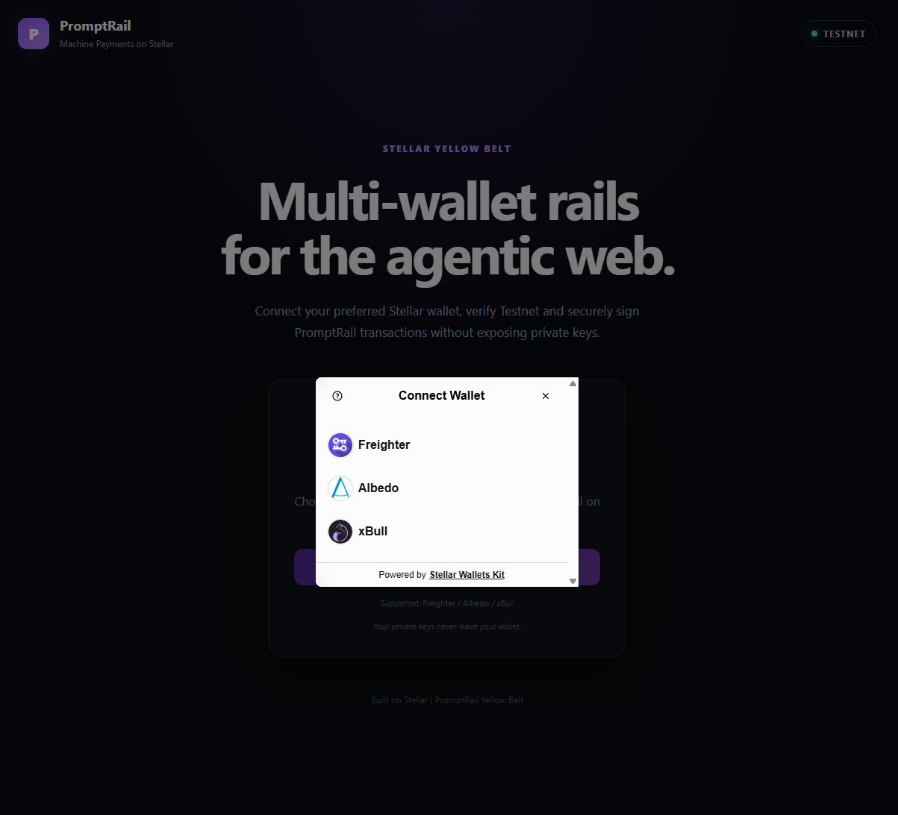
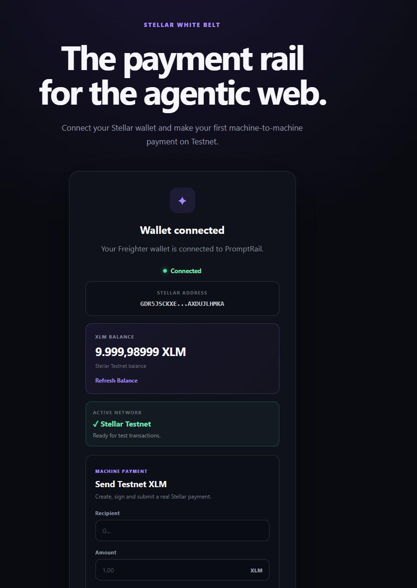
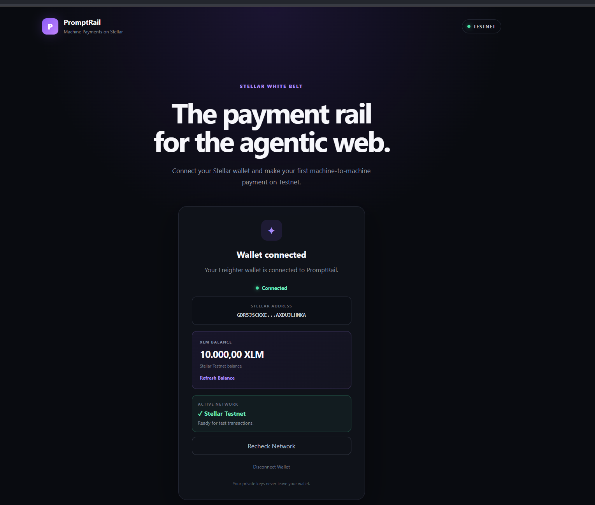
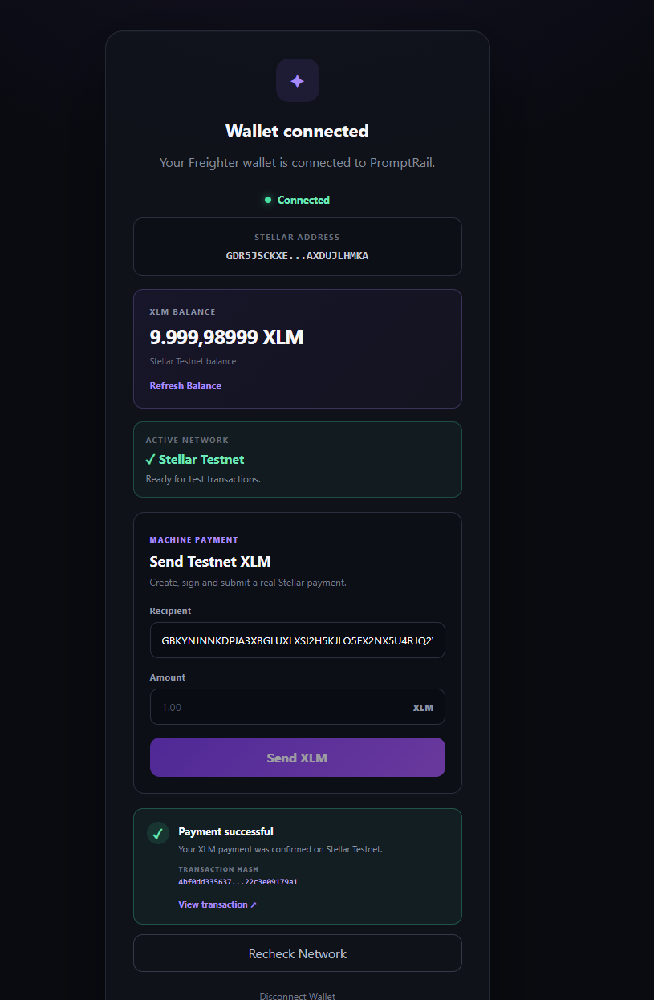
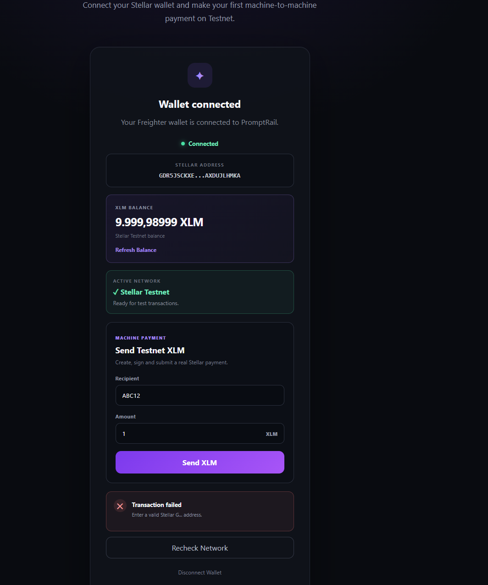

# PromptRail

**Machine Payments on Stellar**

PromptRail is a Stellar Testnet dApp built for the **Stellar Journey to Mastery — Yellow Belt Challenge**.

It pairs a **deployed Soroban smart contract** with a React frontend that drives it end to end.

The on-chain half is a **Payment Tracker**: an escrow contract that holds XLM
while a payment is in flight and tracks its status across many recipients.

* Escrowed payments with a `Pending` / `Completed` / `Cancelled` lifecycle
* Multi-address batches — one payment per recipient in a single invocation
* Sender-authorized release and refund
* On-chain events for every state change

The off-chain half is a **multi-wallet dApp** built on
[StellarWalletsKit](https://stellarwalletskit.dev/):

* Connecting any supported Stellar wallet — **Freighter, Albedo, or xBull** —
  through a wallet-selection modal
* Live payment status and a contract event feed that update in near-real-time
* Distinctly surfaced error handling (wallet not found, request rejected,
  insufficient balance)
* Detecting and validating the active Stellar network
* Fetching an account's XLM balance
* Building a Stellar payment transaction
* Signing the transaction securely in the user's chosen wallet
* Submitting the signed transaction to Stellar Testnet
* Displaying transaction success, failure, and transaction hash information

PromptRail is designed as the first technical foundation for a broader vision: enabling programmable and machine-to-machine payments for APIs and AI agents using Stellar.

---

## Live Demo

[Deployment link is here.](https://promptrail-ten.vercel.app/)

---

### Deployment Status

PromptRail is deployed publicly on Vercel and has been tested end-to-end on Stellar Testnet.

Verified production flow:

- ✅ Multi-wallet connection (Freighter / Albedo / xBull)
- ✅ Stellar Testnet detection
- ✅ XLM balance retrieval
- ✅ XLM transaction creation
- ✅ Wallet transaction signing
- ✅ Stellar Testnet submission
- ✅ Transaction confirmation
- ✅ Transaction hash and explorer link

---

## Smart Contract (Soroban)

PromptRail's settlement layer is a Soroban contract that escrows XLM while a
payment is in flight and tracks its status on-chain.

### Deployment

| | |
| --- | --- |
| **Network** | Stellar Testnet (`Test SDF Network ; September 2015`) |
| **Contract ID** | `CDWVMXTDTU6DJUG3BDUKI6SK72VIAVTJ44VWCL2VZ7OX5TCRRVD7HH6X` |
| **Wasm hash** | `06a0f8e8b789dc7dc4b66a0710506ae4a9940a5663e0f7ef0a8d477a307377f4` |
| **Settlement token** | Native XLM SAC — `CDLZFC3SYJYDZT7K67VZ75HPJVIEUVNIXF47ZG2FB2RMQQVU2HHGCYSC` |
| **Deployer** | `GDMLL4EVSZHPFB3IES7XH72TNFITQ64G3S57SAHOE5L6LBZV4LPRZDJY` |
| **Source** | [contracts/payment-tracker/src/lib.rs](contracts/payment-tracker/src/lib.rs) |
| **Tests** | [contracts/payment-tracker/src/test.rs](contracts/payment-tracker/src/test.rs) |

### Proof of invocation

A real `create_payment` call against the deployed contract (escrowed 0.5 XLM,
payment id `3`, later released with `complete_payment`):

```text
Transaction hash:
d13babf0aefbad0edd6f2057a6b85f58b4d38dee3d26f3226091bfe833081c0d
```

* [View on stellar.expert](https://stellar.expert/explorer/testnet/tx/d13babf0aefbad0edd6f2057a6b85f58b4d38dee3d26f3226091bfe833081c0d)
* [View on Horizon (always live)](https://horizon-testnet.stellar.org/transactions/d13babf0aefbad0edd6f2057a6b85f58b4d38dee3d26f3226091bfe833081c0d)

The matching `complete_payment` is
[`c7b8739f…`](https://stellar.expert/explorer/testnet/tx/c7b8739f09343f51e38cd654aba3a3201241c0532c0cd052d9a3ec054eae1ecb)
([Horizon](https://horizon-testnet.stellar.org/transactions/c7b8739f09343f51e38cd654aba3a3201241c0532c0cd052d9a3ec054eae1ecb)).
The full invocation history is tabulated under
[Verified on-chain activity](#verified-on-chain-activity).

### Verify the deployment

* **stellar.expert** — [contract page](https://stellar.expert/explorer/testnet/contract/CDWVMXTDTU6DJUG3BDUKI6SK72VIAVTJ44VWCL2VZ7OX5TCRRVD7HH6X)
* **Stellar Lab** — [contract page](https://lab.stellar.org/r/testnet/contract/CDWVMXTDTU6DJUG3BDUKI6SK72VIAVTJ44VWCL2VZ7OX5TCRRVD7HH6X)
* **stellarchain.io** — [contract page](https://testnet.stellarchain.io/contracts/CDWVMXTDTU6DJUG3BDUKI6SK72VIAVTJ44VWCL2VZ7OX5TCRRVD7HH6X)

Third-party Testnet indexers can lag behind the ledger by a while, so the
authoritative checks are Horizon and the contract's own interface, both of which
respond immediately:

* [All deployer transactions on Horizon](https://horizon-testnet.stellar.org/accounts/GDMLL4EVSZHPFB3IES7XH72TNFITQ64G3S57SAHOE5L6LBZV4LPRZDJY/transactions?order=desc)

Read the deployed contract's interface straight off the ledger:

```bash
stellar contract info interface --id CDWVMXTDTU6DJUG3BDUKI6SK72VIAVTJ44VWCL2VZ7OX5TCRRVD7HH6X --network testnet
```

Query its live state without a wallet:

```bash
stellar contract invoke --id CDWVMXTDTU6DJUG3BDUKI6SK72VIAVTJ44VWCL2VZ7OX5TCRRVD7HH6X --source deployer --network testnet -- get_payment_count
```

### How the escrow works

```text
create_payment ──▶ [ Pending ]  XLM held by the contract
                       │
        complete_payment ──▶ [ Completed ]  XLM released to recipient
        cancel_payment   ──▶ [ Cancelled ]  XLM refunded to sender
```

`Completed` and `Cancelled` are terminal. Only a `Pending` payment can
transition, which is what makes double-complete and double-cancel impossible.
Both transitions are authorized by the **sender**, who either releases the
escrow to the recipient or claws it back.

### Contract interface

| Function | Kind | Description |
| --- | --- | --- |
| `initialize(token: Address)` | write | Sets the settlement token. Callable exactly once. |
| `create_payment(from: Address, to: Address, amount: i128) -> u32` | write | Escrows `amount` from `from` and records a `Pending` payment. Returns the new id. |
| `create_batch(from: Address, recipients: Vec<(Address, i128)>) -> Vec<u32>` | write | Multi-address flow: one independent payment per recipient in a single invocation. Returns the new ids. |
| `complete_payment(id: u32)` | write | Sender-authorized. Releases escrow to the recipient, status → `Completed`. |
| `cancel_payment(id: u32)` | write | Sender-authorized. Refunds escrow to the sender, status → `Cancelled`. |
| `get_payment(id: u32) -> Payment` | read | Full payment record. |
| `get_payment_count() -> u32` | read | Total number of payments ever created. |
| `get_sent_ids(addr: Address) -> Vec<u32>` | read | Ids of payments sent by an address. |
| `get_received_ids(addr: Address) -> Vec<u32>` | read | Ids of payments received by an address. |
| `get_token() -> Address` | read | The configured settlement token. |

A `Payment` record carries `id`, `from`, `to`, `amount`, `status`,
`created_at`, and `updated_at`.

### Events

Every state change emits a typed `#[contractevent]`, so the lifecycle is
decodable by explorers and generated clients. `from` and `to` are indexed
topics, which lets an indexer subscribe to a single counterparty.

| Event | Topics | Data |
| --- | --- | --- |
| `payment_created` | `from`, `to` | `id`, `amount` |
| `payment_completed` | `from`, `to` | `id`, `amount` |
| `payment_cancelled` | `from`, `to` | `id`, `amount` |
| `tracker_initialized` | — | `token` |

### Errors

| Code | Error | Raised when |
| --- | --- | --- |
| 1 | `AlreadyInitialized` | `initialize` is called twice |
| 2 | `NotInitialized` | No settlement token configured |
| 3 | `InvalidAmount` | Amount is zero or negative |
| 4 | `PaymentNotFound` | No payment with that id |
| 5 | `NotPending` | Payment is already `Completed` or `Cancelled` |
| 6 | `EmptyBatch` | `create_batch` called with no recipients |
| 7 | `BatchTooLarge` | `create_batch` exceeds 100 recipients |
| 8 | `SelfPayment` | Sender and recipient are the same address |

### Verified on-chain activity

Every function below was invoked against the deployed contract on Testnet:

| Action | Transaction |
| --- | --- |
| Deploy | [`9a75966a…`](https://stellar.expert/explorer/testnet/tx/9a75966a7c395228434f6774f0e831013cefaff474c2192dbd944660c2e143eb) |
| `initialize` | [`f3ef0fa5…`](https://stellar.expert/explorer/testnet/tx/f3ef0fa5f330e39e87e49f27d2baa38a89d413ca3bd82a6148314c2d9265e131) |
| `create_payment` (2 XLM, id 0) | [`875ccf85…`](https://stellar.expert/explorer/testnet/tx/875ccf85104e3368f568615e327ea4d3d9601e64c9f46e99765c6f8030538313) |
| `complete_payment` (id 0) | [`0c5f0faf…`](https://stellar.expert/explorer/testnet/tx/0c5f0faf9a56232f52898aebe7c7d1b2290a7551d2d9b72db014106ccf072cf6) |
| `create_batch` (2 recipients, ids 1 & 2) | [`f563d568…`](https://stellar.expert/explorer/testnet/tx/f563d56807a758a6bee84d097ca6aeee2f5d7af05a556a875c5227701cb74b61) |
| `complete_payment` (id 1) | [`4dcfe1bf…`](https://stellar.expert/explorer/testnet/tx/4dcfe1bfec29b8b8eca1d4276a5cf906b0a53084eda6b0d421408c025c78cd88) |
| `cancel_payment` (id 2) | [`50664433…`](https://stellar.expert/explorer/testnet/tx/50664433fb25b97965f0b4c2ac9c3c5957cf0a8cd07bb81958d750088b6a17d2) |
| `create_payment` (0.5 XLM, id 3) | [`d13babf0…`](https://stellar.expert/explorer/testnet/tx/d13babf0aefbad0edd6f2057a6b85f58b4d38dee3d26f3226091bfe833081c0d) |
| `complete_payment` (id 3) | [`c7b8739f…`](https://stellar.expert/explorer/testnet/tx/c7b8739f09343f51e38cd654aba3a3201241c0532c0cd052d9a3ec054eae1ecb) |

Every one of those transactions is confirmed successful on Horizon — for
example, the `create_payment` above landed in ledger 4380292:

```bash
curl https://horizon-testnet.stellar.org/transactions/875ccf85104e3368f568615e327ea4d3d9601e64c9f46e99765c6f8030538313
```

Re-completing payment `0` on the live contract correctly fails with
`Error(Contract, #5)` (`NotPending`), and `get_payment_count` returns `3`.

### Frontend integration

The dApp talks to the deployed contract directly — there is no backend.

* [`src/contract/paymentTracker.ts`](src/contract/paymentTracker.ts) is a typed
  client. Read-only views run through Soroban RPC **simulation**, so listing
  payments costs nothing and needs no signature. State-changing calls are
  prepared against RPC, signed by **the connected wallet** (via
  StellarWalletsKit), submitted, and polled to
  confirmation.
* [`src/components/PaymentTracker.tsx`](src/components/PaymentTracker.tsx) is
  the UI panel. It lists the connected wallet's sent payments with live
  `Pending` / `Completed` / `Cancelled` status, offers **Complete** and
  **Cancel** on pending rows, and supports both a single payment and a
  multi-recipient batch.

Addresses and amounts are validated before a signing prompt is ever raised, and
contract error codes are mapped back to readable messages.

---

## Contract Development

### Prerequisites

* [Rust](https://rustup.rs/) with the `wasm32v1-none` target
* [Stellar CLI](https://developers.stellar.org/docs/tools/developer-tools/cli/install-cli) 27.x

```bash
rustup target add wasm32v1-none
```

### Test

```bash
cargo test
```

### Build

```bash
stellar contract build
```

The optimized wasm is written to
`target/wasm32v1-none/release/payment_tracker.wasm`.

### Deploy

Create and fund a Testnet identity:

```bash
stellar keys generate deployer --network testnet --fund
```

Deploy the contract:

```bash
stellar contract deploy --wasm target/wasm32v1-none/release/payment_tracker.wasm --source deployer --network testnet
```

Resolve the native XLM Stellar Asset Contract and wire it in as the settlement
token (this is the one-time `initialize` call):

```bash
stellar contract id asset --asset native --network testnet
```

```bash
stellar contract invoke --id <CONTRACT_ID> --source deployer --network testnet -- initialize --token <NATIVE_SAC_ID>
```

### Invoke

Create an escrowed payment (amounts are in stroops; 1 XLM = 10,000,000):

```bash
stellar contract invoke --id <CONTRACT_ID> --source deployer --network testnet -- create_payment --from <SENDER_G...> --to <RECIPIENT_G...> --amount 20000000
```

Release it to the recipient:

```bash
stellar contract invoke --id <CONTRACT_ID> --source deployer --network testnet -- complete_payment --id 0
```

Pay several recipients in one invocation:

```bash
stellar contract invoke --id <CONTRACT_ID> --source deployer --network testnet -- create_batch --from <SENDER_G...> --recipients '[["<RECIPIENT_A>","10000000"],["<RECIPIENT_B>","15000000"]]'
```

---

## Multi-Wallet Support

PromptRail connects through
[StellarWalletsKit](https://stellarwalletskit.dev/), so the user picks their
wallet in a selection modal instead of being locked to one extension:

| Wallet | Type |
| --- | --- |
| Freighter | Browser extension |
| Albedo | Web-based signer |
| xBull | Browser extension / web |



The connect card also lists each wallet with a live **detected** badge or an
**install** link before any connection attempt. All signing — White Belt XLM
payments and Payment Tracker contract calls alike — goes through the kit, so
every flow works with whichever wallet the user chose.

Implementation: [src/services/wallet.ts](src/services/wallet.ts)

---

## Error Handling

Every failure funnels through one taxonomy in [src/errors.ts](src/errors.ts),
and the three review-relevant cases render with their own banner title,
message, and follow-up hint — not a generic catch-all:

| Error | Detection | User sees |
| --- | --- | --- |
| **Wallet not found** | Wallet availability is probed before connect (`getWalletOptions`), and a not-installed failure from the kit maps to `WALLET_NOT_FOUND` | "Wallet not found" banner naming the wallet, plus an install link for that wallet |
| **User rejected** | A declined connection or signature in the wallet maps to `USER_REJECTED` | "Request declined in wallet" banner, with a reassurance that nothing was submitted |
| **Insufficient balance** | Pre-checked against the spendable balance before any signing prompt, in both the XLM payment form and the Payment Tracker; `op_underfunded` / `tx_insufficient_balance` / SAC balance errors map to the same case if it slips through | "Insufficient balance" banner with the amounts, plus a Friendbot funding hint |

Wrong-network and Soroban contract error codes (`Error(Contract, #N)`) are
mapped in the same file.

---

## Real-Time Event Integration

The contract emits typed `#[contractevent]`s on every state change, and the
frontend consumes them without a backend:

* **Live payment list** — the tracker polls the contract's read-only views
  every 8 seconds, so a payment completed from anywhere (another browser, the
  CLI) transitions `Pending → Completed/Cancelled` on screen without a page
  refresh.
* **Contract event feed** — recent `payment_created` / `payment_completed` /
  `payment_cancelled` events are fetched straight from Soroban RPC
  (`getEvents`), decoded, and listed with amount, ledger, timestamp, and an
  explorer link per transaction.
* **In-flight transaction status** — submissions show a live indicator:
  *waiting for wallet signature* → *submitted, waiting for confirmation* (with
  the tx hash linked as soon as the network accepts it) → confirmed or a
  distinct error.

Implementation: [src/components/PaymentTracker.tsx](src/components/PaymentTracker.tsx)
and `fetchContractEvents` in
[src/contract/paymentTracker.ts](src/contract/paymentTracker.ts).

---

## Yellow Belt Requirements

| Requirement                          | Status |
| ------------------------------------ | ------ |
| Soroban smart contract source         | ✅      |
| Cargo workspace at repository root    | ✅      |
| Contract unit tests (13 passing)      | ✅      |
| Contract deployed to Stellar Testnet  | ✅      |
| Contract ID documented in README      | ✅      |
| Contract invoked on-chain (tx hash below) | ✅  |
| Frontend calls the deployed contract  | ✅      |
| Multi-wallet via StellarWalletsKit    | ✅      |
| Wallet options screenshot             | ✅      |
| Wallet not found — distinct error     | ✅      |
| User rejected — distinct error        | ✅      |
| Insufficient balance — distinct error | ✅      |
| Real-time status + contract events    | ✅      |

Carried forward from the White Belt stage:

| Requirement                        | Status |
| ---------------------------------- | ------ |
| Wallet setup (now multi-wallet)    | ✅      |
| Stellar Testnet support            | ✅      |
| Wallet connect                     | ✅      |
| Wallet disconnect                  | ✅      |
| Fetch XLM balance                  | ✅      |
| Display XLM balance                | ✅      |
| Send XLM on Testnet                | ✅      |
| Transaction signing in the wallet  | ✅      |
| Success feedback                   | ✅      |
| Failure feedback                   | ✅      |
| Transaction hash display           | ✅      |
| Stellar explorer link              | ✅      |
| Error handling                     | ✅      |
| Public GitHub repository           | ✅      |
| 10+ meaningful commits             | ✅      |
| Public deployment                  | ✅      |

---

## Screenshots

### Wallet Connected

The application connects the selected wallet and displays the connected Stellar public address.



---

### XLM Balance

PromptRail fetches the connected wallet's native XLM balance directly from Stellar Testnet through Horizon.



---

### Successful Testnet Transaction

A real XLM payment is created, signed in the connected wallet, submitted to Stellar Testnet, and confirmed by Horizon.

The interface displays the transaction hash and provides a direct link to the transaction on Stellar Expert.



---

### Transaction Error Handling

PromptRail validates transaction inputs and provides clear failure feedback when a payment cannot be completed.



---

## How It Works

```text
User
  │
  ▼
PromptRail
  │
  ├── Connect wallet (kit modal)
  │
  ▼
Stellar Wallet (via kit)
  │
  ├── Public Stellar Address
  │
  ▼
Stellar Horizon Testnet
  │
  ├── Account Data
  └── XLM Balance

Payment Flow
  │
  ▼
Recipient + Amount
  │
  ▼
TransactionBuilder
  │
  ▼
XLM Payment Operation
  │
  ▼
Wallet Signature
  │
  ▼
Signed XDR
  │
  ▼
Stellar Horizon Testnet
  │
  ▼
Transaction Confirmed
  │
  ▼
Transaction Hash + Updated Balance
```

---

## Features

### Multi-Wallet Integration (StellarWalletsKit)

PromptRail opens a wallet-selection modal (Freighter, Albedo, xBull), shows which wallets are detected in the browser, and requests access to the user's Stellar public address.

Private keys are never exposed to PromptRail.

---

### Network Validation

The application reads the currently active network from the connected wallet.

Transactions are only allowed when the wallet is connected to:

```text
Stellar Testnet
```

If the wallet is connected to the public Stellar network instead, PromptRail displays a warning and prevents Testnet transaction activity.

---

### XLM Balance

PromptRail loads the connected Stellar account through Horizon and displays its native XLM balance.

The balance can also be manually refreshed from the interface.

---

### XLM Payments

Users can enter:

* A Stellar recipient address
* An XLM amount

PromptRail then:

1. Validates the destination address
2. Validates the amount
3. Confirms that the recipient exists on Stellar Testnet
4. Loads the sender's account
5. Builds an XLM payment transaction
6. Converts the transaction to XDR
7. Requests a signature from the connected wallet
8. Submits the signed transaction to Horizon
9. Displays the transaction result
10. Refreshes the wallet balance

---

### Transaction Feedback

Successful transactions display:

* Success confirmation
* Transaction hash
* Stellar Explorer link
* Updated XLM balance

Failed transactions display a clear error state to the user.

Examples include:

* Invalid Stellar addresses
* Recipient accounts that are not funded
* Incorrect network selection
* Invalid XLM amounts
* Rejected transactions

---

## Technology Stack

### Frontend

* React
* TypeScript
* Vite
* CSS

### Smart Contract

* Rust (`no_std`)
* Soroban SDK 27
* Stellar CLI 27
* `wasm32v1-none` target

### Stellar

* Stellar JavaScript SDK
* StellarWalletsKit (Freighter, Albedo, xBull)
* Stellar Horizon
* Soroban RPC
* Stellar Testnet

### Development

* ESLint
* Cargo
* Git
* GitHub

---

## Installation

### Prerequisites

Make sure the following are installed:

* Node.js 20+
* npm
* Git
* A supported Stellar wallet: the **Freighter** or **xBull** browser
  extension, or **Albedo** (web-based, nothing to install)

The wallet must be configured for **Stellar Testnet**.

For contract development additionally install Rust and the Stellar CLI — see
[Contract Development](#contract-development).

---

### Clone the Repository

```bash
git clone https://github.com/barbarosalagoz/promptrail.git
cd promptrail
```

---

### Install Dependencies

```bash
npm install
```

---

### Start the Development Server

```bash
npm run dev
```

Vite will provide a local development URL, typically:

```text
http://localhost:5173
```

Open it in a browser with your wallet available. No environment variables are
needed — the deployed contract ID and Testnet endpoints are part of the app
configuration
([src/contract/paymentTracker.ts](src/contract/paymentTracker.ts)).

---

### Production Build

```bash
npm run build
```

The static site is emitted to `dist/`. `npm run lint` runs the ESLint suite.

---

## Using PromptRail

### 1. Connect a Wallet

Click:

```text
Connect Wallet
```

Pick a wallet in the selection modal (Freighter, Albedo, or xBull) and approve the connection request.

---

### 2. Switch to Testnet

PromptRail verifies the active Stellar network.

The application should display:

```text
✓ Stellar Testnet
Ready for test transactions.
```

---

### 3. Fund Your Testnet Wallet

A Stellar Testnet account must be funded before it exists on the Testnet ledger.

Use Stellar's Testnet funding tools to obtain test XLM.

Testnet XLM has no monetary value.

---

### 4. Check Your Balance

After the Testnet account is funded, PromptRail retrieves and displays the current XLM balance.

---

### 5. Send XLM

Enter:

```text
Recipient: G...
Amount: 1
```

Click:

```text
Send XLM
```

The connected wallet will open a transaction approval request.

Review the transaction and approve the signature.

---

### 6. Transaction Confirmation

After Horizon accepts the transaction, PromptRail displays:

```text
✓ Payment successful

Transaction Hash
xxxxxxxxxxxx...xxxxxxxxxxxx

View transaction ↗
```

The wallet balance is refreshed automatically after confirmation.

---

## Security

PromptRail never requests, stores, or handles a user's private key.

Transaction signing occurs inside the connected wallet.

The application only receives:

* The public Stellar address
* Wallet network information
* Signed transaction XDR after user approval

This project currently operates exclusively on **Stellar Testnet**.

---

## Project Structure

```text
promptrail/
│
├── Cargo.toml                     # Soroban workspace root
├── Cargo.lock
│
├── contracts/
│   └── payment-tracker/
│       ├── Cargo.toml
│       └── src/
│           ├── lib.rs             # Payment Tracker contract
│           └── test.rs            # contract unit tests
│
├── docs/
│   └── screenshots/
│       ├── wallet-connected.png
│       ├── balance-testnet.png
│       ├── payment-success.png
│       └── payment-error.png
│
├── src/
│   ├── App.tsx
│   ├── App.css
│   ├── index.css
│   ├── main.tsx
│   ├── errors.ts                  # error taxonomy: wallet not found,
│   │                              #   user rejected, insufficient balance...
│   ├── services/
│   │   └── wallet.ts              # multi-wallet service (StellarWalletsKit)
│   ├── components/
│   │   └── PaymentTracker.tsx     # tracker UI: live status, event feed
│   └── contract/
│       └── paymentTracker.ts      # typed client + RPC event fetching
│
├── public/
│
├── package.json
├── package-lock.json
├── tsconfig.json
├── vite.config.ts
└── README.md
```

---

## Development Progress

PromptRail was developed incrementally with meaningful Git commits covering:

1. Project initialization
2. Base dashboard interface
3. Freighter wallet integration
4. Stellar Testnet network validation
5. XLM balance handling
6. Signed XLM Testnet payments
7. Transaction screenshots and testing
8. Project documentation
9. Deployment preparation
10. Soroban workspace scaffolding
11. Payment Tracker contract implementation
12. Contract unit tests
13. Testnet deployment and on-chain verification
14. Frontend integration with the deployed contract
15. Centralized error taxonomy
16. StellarWalletsKit multi-wallet integration
17. Wallet-kit signing for contract calls and balance pre-checks
18. Real-time status polling and contract event feed
19. Wallet options screenshot and README updates

---

## Yellow Belt Learning Outcomes

This project demonstrates practical understanding of:

* Writing Soroban smart contracts in Rust
* Contract storage, TTL management, and data keys
* Contract errors and state-machine guards
* Typed contract events
* Cross-contract calls into the Stellar Asset Contract
* Escrow and authorization (`require_auth`)
* Contract unit testing with the Soroban test environment
* Building, deploying, and invoking a contract on Testnet
* Calling a deployed contract from a React frontend
* Multi-wallet integration with StellarWalletsKit
* Consuming contract events through Soroban RPC in near-real-time
* Typed, user-facing error taxonomies for Web3 failures
* Stellar account architecture
* Stellar public addresses
* Testnet development
* Horizon account queries
* XLM balances
* Stellar transactions
* Payment operations
* XDR serialization
* Wallet-based transaction signing
* Transaction submission
* Transaction hashes
* Blockchain explorer verification
* User-facing Web3 error handling

---

## Future Vision

With the Payment Tracker contract live on Testnet, PromptRail now has both
halves of a machine-payment system: an on-chain settlement layer and a wallet
frontend that drives it.

Future versions may introduce:

* Paid API endpoints
* Stablecoin payments
* Usage-based API billing
* AI agent payments
* Machine-to-machine payment flows
* Developer SDKs
* Payment analytics
* Mainnet support

The long-term idea is simple:

> Make digital services directly purchasable by software.

---

## Challenge

Built for:

**Stellar Journey to Mastery — Yellow Belt**

Network:

**Stellar Testnet**

---

## License

MIT
