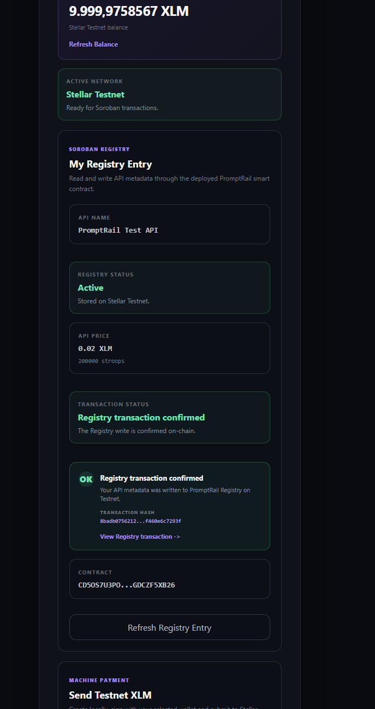
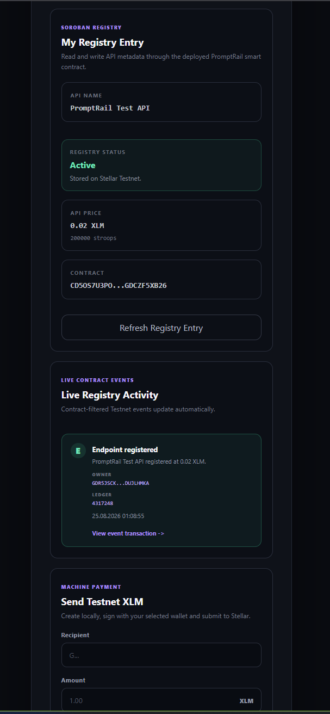

# PromptRail

**Smart contract rails for machine payments on Stellar.**

PromptRail is a Stellar Testnet dApp built for the **Rise In Stellar Journey to Mastery — Yellow Belt** challenge.

The Yellow Belt version extends the original wallet/payment prototype with:

- Multi-wallet Stellar connectivity
- A deployed Soroban Registry smart contract
- Wallet-authorized contract writes
- Typed generated contract bindings
- Transaction lifecycle feedback
- Contract-filtered live event activity
- Testnet XLM payments

> **Network:** Stellar Testnet

---

## Live Demo

**Production:** https://promptrail-ten.vercel.app

---

## Yellow Belt Highlights

### Multi-wallet support

PromptRail uses Stellar Wallets Kit with an explicit wallet allowlist:

- Freighter
- Albedo
- xBull

The app does not use Wallets Kit `defaultModules()`.

Handled connection/signing cases include:

- Wallet unavailable
- User rejected request
- Wrong Stellar network
- Wallet disconnected
- Signing failure

Classic XLM payment flows also surface insufficient-balance and Stellar transaction failures.

---

## Soroban Registry

PromptRail Registry stores API endpoint metadata on Stellar Testnet.

Each Registry entry contains:

```text
owner
name
price
active
```

The Yellow Belt contract exports:

```text
register
get
update_price
set_active
```

### Contract Address

```text
CD5OS7U3PO3TFSRKZXV4ZH3AQFKWZSGAPE6ENGBBXCQRLTGDCZF5XB26
```

### Network

```text
Stellar Testnet
```

### Deployer Public Key

```text
GD4ZZVS4TTHJG5MVVQ75KWKEDGKONSAR4HHZH6YIMYWQPEZXH6EQWG3A
```

No deployer private key or seed is stored in this repository.

---

## Verified Contract Call

Initial verified Registry registration transaction:

```text
b7d372e76ac6b83662f68072d21fe3cd202406c9efe6126ef423a16d6cc867b9
```

Ledger:

```text
4316493
```

Registered entry:

```text
Name:  PromptRail Demo API
Price: 200000 stroops
       = 0.02 XLM
```

Explorer:

https://stellar.expert/explorer/testnet/tx/b7d372e76ac6b83662f68072d21fe3cd202406c9efe6126ef423a16d6cc867b9

A separate frontend wallet-signed Registry registration is shown in the screenshots below.

---

## Wallet-signed Registry Writes

Registry writes are initiated by the frontend and signed by the connected Stellar wallet.

The UI exposes the transaction lifecycle:

```text
PREPARING
    ↓
AWAITING_SIGNATURE
    ↓
PENDING
    ↓
SUCCESS / FAILED
```

PromptRail only displays a successful Registry write after the Soroban transaction has finalized.

Before signing, the frontend validates:

- Connected account
- Stellar Testnet network
- Owner address
- API name
- UTF-8 name length
- Price bounds
- Simulated contract result
- Unexpected non-invoker authorization requirements

The contract independently enforces owner authorization with `require_auth()` on state-changing methods.

---

## Live Registry Activity

PromptRail includes a live contract event feed.

The frontend polls Stellar RPC approximately every 3 seconds and filters events to the deployed PromptRail Registry contract.

Supported Registry event types:

```text
EndpointRegistered
PriceUpdated
StatusChanged
```

The event service:

- Filters by exact contract ID
- Decodes Soroban event values
- Deduplicates events by event ID
- Tracks the RPC cursor
- Prevents overlapping polling requests
- Ignores unsupported event types
- Displays the event owner
- Displays the ledger
- Links to the originating transaction

This provides near-real-time synchronization between on-chain Registry activity and the frontend.

---

## Machine Payments

PromptRail also retains the original Testnet XLM payment flow.

Payments are:

1. Built locally in the browser
2. Signed by the connected wallet
3. Submitted to Stellar Testnet through Horizon
4. Confirmed by Stellar
5. Linked to Stellar Expert

PromptRail never handles the user's private key.

---

## Architecture

```text
                    ┌─────────────────────┐
                    │      React UI       │
                    │       + Vite        │
                    └──────────┬──────────┘
                               │
              ┌────────────────┴────────────────┐
              │                                 │
              ▼                                 ▼
┌─────────────────────────┐        ┌─────────────────────────┐
│ Stellar Wallets Kit     │        │ Generated TS Bindings   │
│                         │        │                         │
│ Freighter               │        │ PromptRail Registry     │
│ Albedo                  │        └────────────┬────────────┘
│ xBull                   │                     │
└────────────┬────────────┘                     ▼
             │                      ┌─────────────────────────┐
             │                      │ Stellar Soroban RPC     │
             │                      │        Testnet          │
             │                      └────────────┬────────────┘
             │                                   │
             │                                   ▼
             │                      ┌─────────────────────────┐
             │                      │ PromptRail Registry     │
             │                      │ Soroban Contract        │
             │                      └─────────────────────────┘
             │
             ▼
┌─────────────────────────┐
│ Stellar Horizon         │
│ Testnet XLM Payments    │
└─────────────────────────┘
```

---

## Smart Contract Security

The Registry contract includes:

- `owner.require_auth()` on state-changing methods
- Maximum API name length
- Positive-price requirement
- Maximum price bound
- Duplicate registration protection
- Typed contract errors
- Contract events
- Side-effect-free `get()`
- Owner-controlled price updates
- Owner-controlled active status

Final local contract test result:

```text
15 passed
0 failed
```

Test coverage includes:

- Successful registration
- Missing authorization
- Authorization tree
- Duplicate registration
- Empty name
- Oversized name
- Zero price
- Negative price
- Price above maximum
- Missing endpoint
- Registry reads
- Price update
- Invalid price update
- Endpoint disable
- Event emission

See [SECURITY.md](./SECURITY.md) for the detailed security review.

---

## Contract Build

Latest verified optimized WASM build:

```text
WASM size:
5192 bytes

WASM hash:
650c9e433562d411bbaa471c616684c230ac7ff65e402354f2e402f748889270
```

Exported functions:

```text
get
register
set_active
update_price
```

---

## Tech Stack

### Frontend

```text
React
TypeScript
Vite
@stellar/stellar-sdk
@creit.tech/stellar-wallets-kit
```

### Blockchain

```text
Stellar Testnet
Soroban
Rust
Stellar CLI
```

### Contract Client

```text
Generated TypeScript Soroban bindings
```

---

## Development

Clone the repository:

```bash
git clone https://github.com/barbarosalagoz/promptrail.git
cd promptrail
```

Checkout the Yellow Belt branch:

```bash
git checkout yellow-belt
```

Install dependencies:

```bash
npm install
```

Start the development server:

```bash
npm run dev
```

Run lint:

```bash
npm run lint
```

Build the production frontend:

```bash
npm run build
```

---

## Soroban Development

Enter the Soroban workspace:

```bash
cd soroban
```

Run tests:

```bash
cargo test
```

Run formatting verification:

```bash
cargo fmt --check
```

Run Clippy with warnings denied:

```bash
cargo clippy --all-targets --all-features -- -D warnings
```

Build the optimized contract:

```bash
stellar contract build
```

Run the Rust dependency audit:

```bash
cargo audit
```

---

## Generated Contract Bindings

The TypeScript client is generated from the deployed Testnet contract:

```powershell
stellar contract bindings typescript `
  --network testnet `
  --contract-id CD5OS7U3PO3TFSRKZXV4ZH3AQFKWZSGAPE6ENGBBXCQRLTGDCZF5XB26 `
  --output-dir .\packages\promptrail_registry `
  --overwrite
```

This keeps the frontend contract interface aligned with the deployed Soroban contract.

---

## Screenshots

### Multi-wallet Selection

PromptRail exposes only the explicitly enabled Stellar wallets: Freighter, Albedo and xBull.


### Connected Wallet

A Stellar wallet connected through Stellar Wallets Kit on Testnet.


### Testnet Balance

PromptRail reads the connected account's native XLM balance from Stellar Testnet.


### Successful XLM Payment

A wallet-signed XLM payment successfully submitted and confirmed on Stellar Testnet.


### Payment Error Handling

PromptRail surfaces failed transaction states instead of treating rejected or invalid transactions as successful.


### Wallet-signed Registry Write

A successful Soroban Registry write signed by the connected Stellar wallet and confirmed on Testnet.



### Live Registry Events

Contract-filtered Stellar Testnet events synchronized into the PromptRail frontend.



---

## Yellow Belt Checklist

- [x] Stellar wallet connection
- [x] Three wallet options
- [x] Wallet failure handling
- [x] Stellar Testnet enforcement
- [x] Soroban smart contract
- [x] Contract deployed to Testnet
- [x] Frontend contract read
- [x] Frontend wallet-signed contract write
- [x] Transaction lifecycle UI
- [x] Successful transaction verification
- [x] Contract events
- [x] Live frontend event synchronization
- [x] Contract security tests
- [x] Frontend dependency security review
- [x] Rust dependency security review
- [x] Final screenshots committed
- [x] Production Yellow Belt deployment

---

## Security Notes

PromptRail Yellow Belt is a **Testnet demonstration project**, not a production financial-security certification.

Do not send real funds to Testnet addresses shown in this repository.

Private keys, wallet seeds and signing secrets must never be committed.

The final local security review recorded:

```text
Frontend npm audit:
0 Critical
0 High
5 Moderate
13 Low

Soroban:
15/15 tests passing
cargo fmt clean
clippy clean with -D warnings
optimized WASM build successful

cargo audit:
No known vulnerability
1 transitive unmaintained warning:
paste 1.0.15 / RUSTSEC-2024-0436
```

See [SECURITY.md](./SECURITY.md) for the full review, including Wallets Kit transitive dependency analysis and the Scout toolchain limitation.

---

## Repository

https://github.com/barbarosalagoz/promptrail

Yellow Belt branch:

```text
yellow-belt
```

---

## Challenge Context

Built as part of the **Stellar Journey to Mastery** builder challenge.
